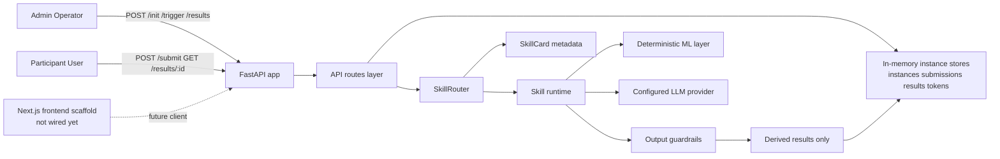
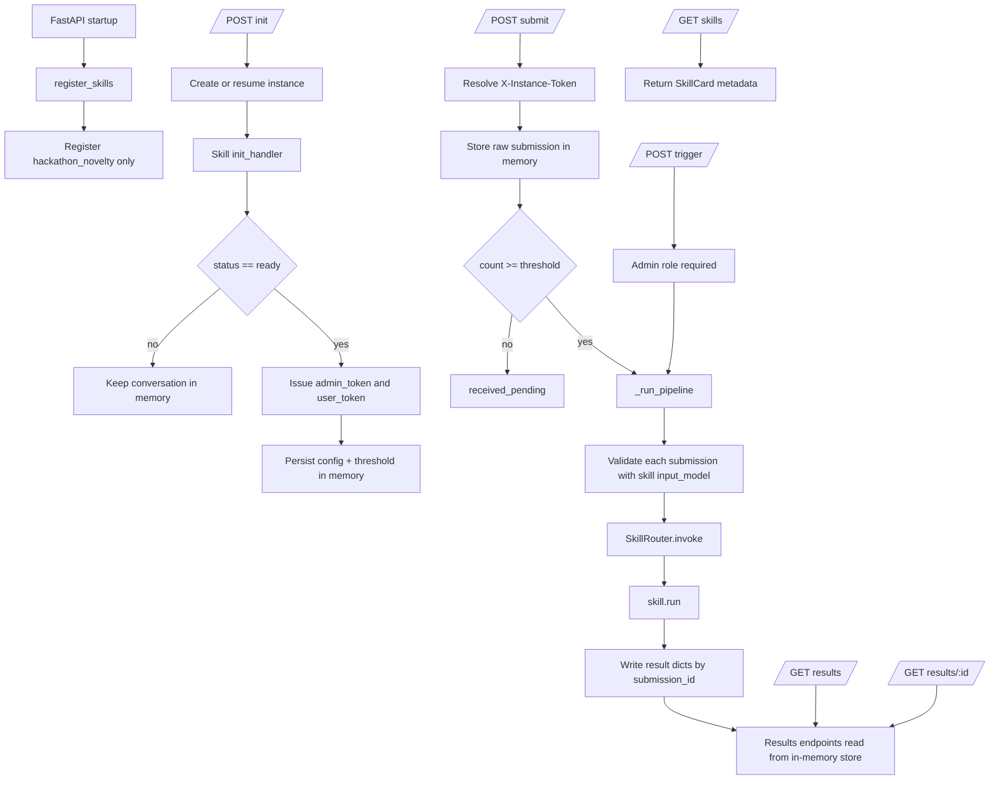
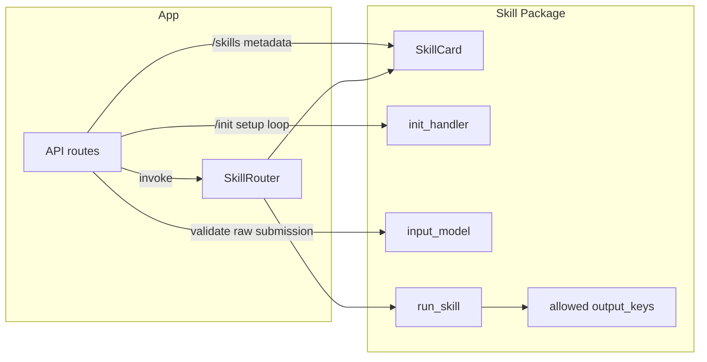
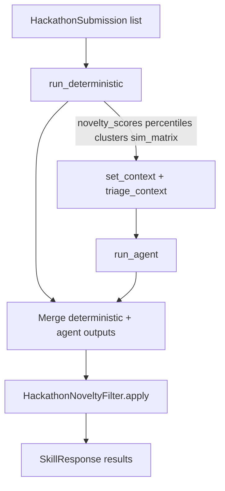
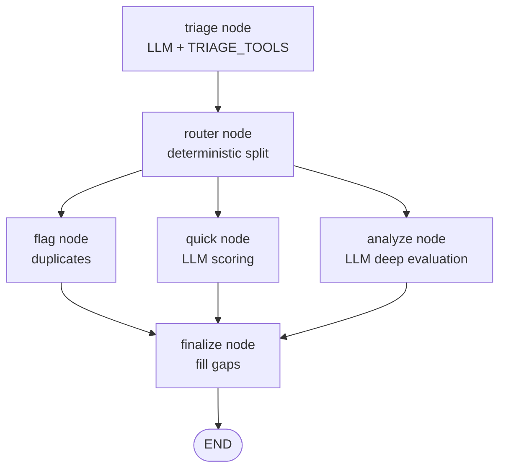
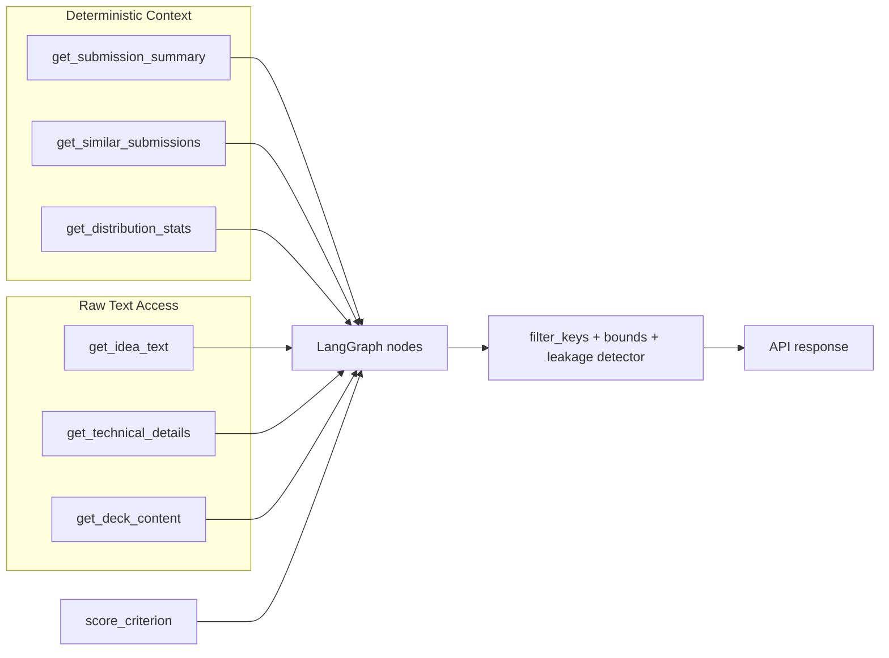
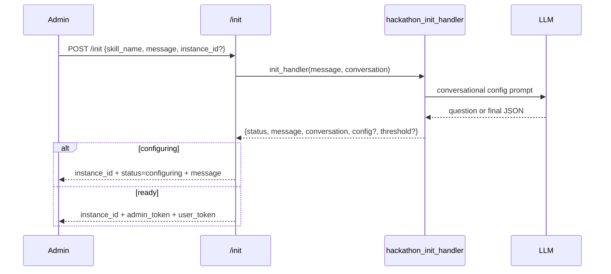

# Conclave Architecture

## Overview

Conclave is currently a Python FastAPI service that exposes a generic skill runtime for enclave-style analysis workflows. The separate Next.js app under `client/` is still a scaffold and is not yet wired into the backend runtime.

The core design is:

- The API owns transport, token resolution, and instance-scoped state.
- A `SkillCard` is the contract between the API and each skill.
- A skill owns its own onboarding flow, runtime pipeline, and output restrictions.
- Only derived outputs are intended to leave the runtime.

## Whole App

## Core Runtime

The backend starts in `main.py`, enables permissive CORS, registers skills, and mounts the API router.

`api/routes.py` is intentionally thin. It does not contain skill-specific business logic. Its responsibilities are:

- create and resume skill instances
- issue and resolve instance tokens
- store submissions and results in memory
- validate submissions against the selected skill's `input_model`
- invoke the skill pipeline through `SkillRouter`
- expose skill metadata through `/skills`

### Request and state flow

## Skills Model

The key abstraction is `SkillCard`. A skill is more than one callable. It is a self-describing package that tells the app:

- what input schema to validate against
- what output keys are allowed to leave the skill
- how the skill is configured
- what trigger modes it supports
- what admin and user roles mean for that skill
- whether it supports conversational setup through `init_handler`

This lets the app remain generic while each skill owns its own behavior.

### App-to-skill contract

## `hackathon_novelty` Deep Dive

`hackathon_novelty` is the only fully implemented skill in the repo today. It is the reference architecture for adding future skills.

Its pipeline is explicitly three-layered:

1. deterministic analysis
2. LangGraph-based agent execution
3. guardrails before returning results

### Skill pipeline

### Layer 1: deterministic analysis

The deterministic layer fuses submission text, computes embeddings, builds a cosine similarity matrix, derives novelty scores, ranks them into percentiles, and clusters submissions with KMeans.

This produces the shared context used by the agent and the output merge step:

- `novelty_scores`
- `percentiles`
- `clusters`
- `sim_matrix`
- ordered `submission_ids`

### Layer 2: LangGraph branching

The agent graph classifies submissions into one of three paths:

- `duplicate` -> handled by a deterministic flag node
- `quick` -> lightweight LLM scoring
- `analyze` -> deeper LLM evaluation with more tool use

### Agent graph

### Layer 3: guardrails

Guardrails do three things:

- strip keys not on the allowed whitelist
- clamp numeric values into expected ranges
- detect raw substring leakage from input content in the output

This is important because the analyze flow does let the LLM inspect raw submission content inside the runtime.

## Tooling and Trust Boundary

The hackathon skill splits tools into derived-context tools and raw-text tools.

- `TRIAGE_TOOLS` expose summary and similarity information
- `ANALYSIS_TOOLS` expose raw idea text, technical details, deck content, and criterion context
- `ALL_TOOLS` combines both

The intended trust model is that raw content stays inside the runtime, while only filtered, derived result fields leave.

## Operator Setup Flow

The setup experience is skill-owned. For `hackathon_novelty`, the `init_handler` runs a multi-turn LLM conversation to collect:

- weighted criteria
- optional guidelines
- submission threshold

Only when the skill says it is ready does the API issue tokens.

## Current Constraints

- State is in memory only. There is no persistent storage layer yet.
- Only `hackathon_novelty` is registered. `dataset_audit` is currently just a stub package.
- The frontend is not integrated with the backend workflow yet.
- The code assumes a single-worker deployment model for submission-trigger safety.
- The shared `user_token` model is a known limitation until per-user auth exists.
- The env file example does not currently match the `CONCLAVE_`-prefixed settings expected by `config.py`.

## Files to Read First

- `main.py`
- `api/routes.py`
- `core/skill_card.py`
- `skills/router.py`
- `skills/hackathon_novelty/__init__.py`
- `skills/hackathon_novelty/deterministic.py`
- `skills/hackathon_novelty/agent.py`
- `skills/hackathon_novelty/tools.py`
- `core/guardrails.py`
