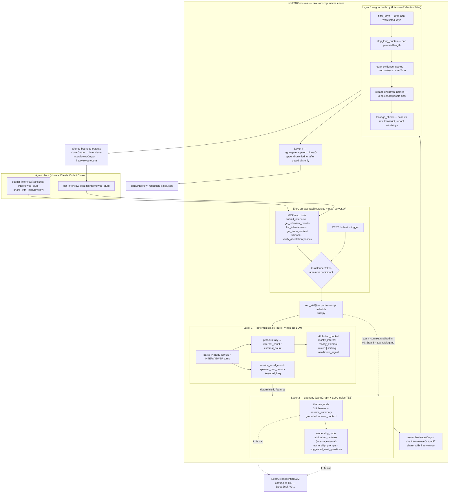
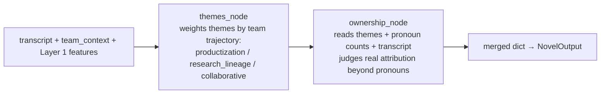
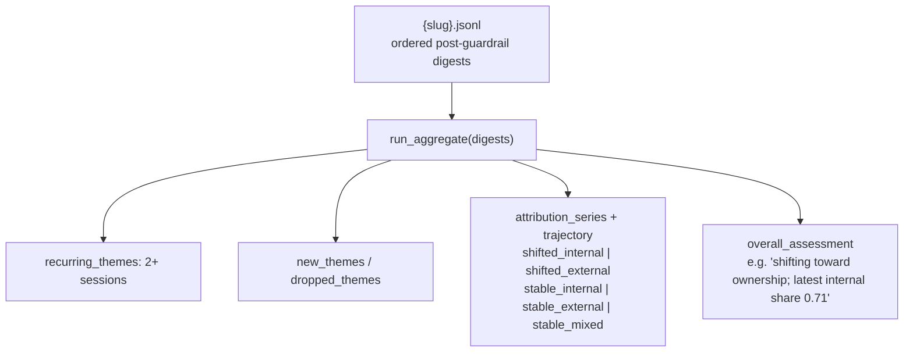

# Interview Reflection Pipeline (Track A v0)

Confidential, TEE-resident pipeline that turns one interview transcript into bounded,
interviewer-facing reflection signals — without the raw transcript ever leaving the enclave.

- **In:** an interview transcript + `interviewee_slug` (+ optional notes, opt-in share flag)
- **Inside (Intel TDX):** deterministic features → LLM themes/ownership → guardrails → append-only ledger
- **Out:** themes, attribution patterns, ownership prompts, suggested next questions, session summary — signed with the enclave key. Raw transcript text never exits.

Pipeline A only (per-interview, team-contextual labeling). Cross-interview clustering (B),
signal-vs-goals (C), and conversational admin query (D) are later phases — see
[`../../plans/new directions/interview_pipeline_architecture.md`](../../plans/new%20directions/interview_pipeline_architecture.md).

## End-to-end flow

## Agent sub-graph (Layer 2)

Two sequential LLM nodes compiled with LangGraph. Each falls back to neutral
defaults if the model is unavailable, so the skill stays usable offline.

## Cross-session aggregation (Layer 4)

Single interviews are noise; value compounds across a slug's session history.
Reads the append-only ledger (never raw transcripts) and derives trajectory.

## Trust boundary in one line

The agent client sees the raw transcript locally; the **enclave** sees it inside TDX;
the **interviewer/coordinator** sees only bounded, signed outputs. Persistence to the
ledger happens **after** guardrails, so raw text can never enter stored history.

## Source map

| Layer | File | Role |
|-------|------|------|
| Entry | `mcp_server.py`, `../../api/routes.py` | MCP tools + REST, token-scoped, signed responses |
| Orchestration | `skill.py` | `run_skill` — runs the four layers per transcript |
| Layer 1 | `deterministic.py` | pronoun/attribution buckets, session stats, keywords |
| Layer 2 | `agent.py` | LangGraph `themes_node → ownership_node` |
| Layer 3 | `guardrails.py` | key whitelist, quote caps, name redaction, leakage scan |
| Layer 4 | `aggregate.py` | per-slug JSONL ledger + cross-session trajectory |
| Contracts | `models.py` | `TranscriptInput`, `NovelOutput`, `IntervieweeOutput` |
